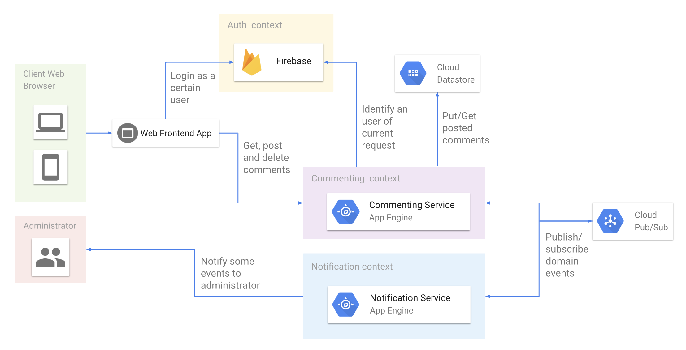

# Commenting service on Google App Engine

An commenting service which is run on Google App Engine and some Google Cloud Platform services, based on Clean Architecture, Domain Driven Design and Microservices Architecture

## About this project

This project is built in order to learn about followings.
- Clean Architecture
- Domain Driven Design
- Microservices Architecture (just a little)

This project keeps these principles as much as possible.  
So this project has some over-engineered parts.

## Application Architecture Overview



- Based on Domain Driven Design, this project has 3 bounded contexts.
  - Commenting context
  - Auth context
  - Notification context
- These contexts are separated into services which independent of each other, like Microservices.
- Commenting service is based on Clean Architecture.

## Domain Driven Design in this project

### Bounded contexts

#### Commenting context (core domain)

Post a comment, delete a comment and view posted comments.

#### Notification context (generic sub domain)

Notify about some events to users or administrators.  
In this project Google Cloud Pub/Sub are used for publishing/subscribing domain event.
This domain subscribes domain events and then notifies to appropriate persons.

#### Auth context (generic sub domain)

This domain helps user authentication.  
In this project Firebase Authentication Service has auth domain role.

## Clean Architecture in Commenting API

### Architecture overview

To be written

### Benefits of Clean Architecture

Because of Clean Architecture, application logic and domain logic are independent with detail of infrastructure.  
Followings are not appeared in the core of the application.

- Various packages which is related to Google App Engine infrastructure
- Technological details of web application on golang (e.g. context.Context)

# Setup

## Requirements

- go 1.8
- google-cloud-sdk
    - goapp
    - dev_appserver.py
- dep

# For local development

### setup

- Create yaml file for your Google App Engine environment
    ```shell
    $ cd /path/to/comment-api-on-gae/src/commenting
    $ cp app/app.template.yaml app/app.yaml
    $ cd /path/to/comment-api-on-gae/src/notification
    $ cp app/app.template.yaml app/app.yaml
    ```
    
- Resolve dependencies
    ```shell
    $ cd /path/to/comment-api-on-gae/src/commenting
    $ GOPATH=/path/to/comment-api-on-gae dep ensure
    $ cd /path/to/comment-api-on-gae/src/notification
    $ GOPATH=/path/to/comment-api-on-gae dep ensure
    ```

### Run

You can run local servers of `commenting` and `notification` services for development.

```shell
$ cd /path/to/comment-api-on-gae/src/commenting
$ GOPATH=/path/to/comment-api-on-gae dev_appserver.py app/XXX.yaml --enable_watching_go_path --log_level=debug --datastore_path=.storage
$ cd /path/to/comment-api-on-gae/src/notification
$ GOPATH=/path/to/comment-api-on-gae dev_appserver.py app/XXX.yaml --enable_watching_go_path --log_level=debug --datastore_path=.storage
```

# For production/staging

## Setup Cloud Services

### Firebase

- Enable anonymous login

### Google cloud pubsub

- Create topic `domain-event`
- Create subscriptions which push to following URLs
    - `https://commenting-dot-[YOUR-PROJECT-NAME].appspot.com/_ah/push-handlers/domain-event`
    - `https://notification-dot-[YOUR-PROJECT-NAME].appspot.com/_ah/push-handlers/domain-event`
    
### Google App Engine

- Commenting service
    - Create datastore index
    - Issue service account which have following privileges
       - Firebase data manager
       - Pubsub editor
- Notification service
    - Issue service account which have following privileges
       - Pubsub editor
    - Add authorized mail sender
    
#### Deploy

- Rewrite yaml for your environment
    
- Execute following commands

    ```shell
    $ cd /path/to/comment-api-on-gae/src/commenting
    $ GOPATH=/path/to/comment-api-on-gae goapp deploy app/[YOUR-GAE-CONFIG-FILE].yaml
    $ cd /path/to/comment-api-on-gae/src/notification
    $ GOPATH=/path/to/comment-api-on-gae goapp deploy /app/[YOUR-GAE-CONFIG-FILE].yaml
    ```


# Testing

todo
